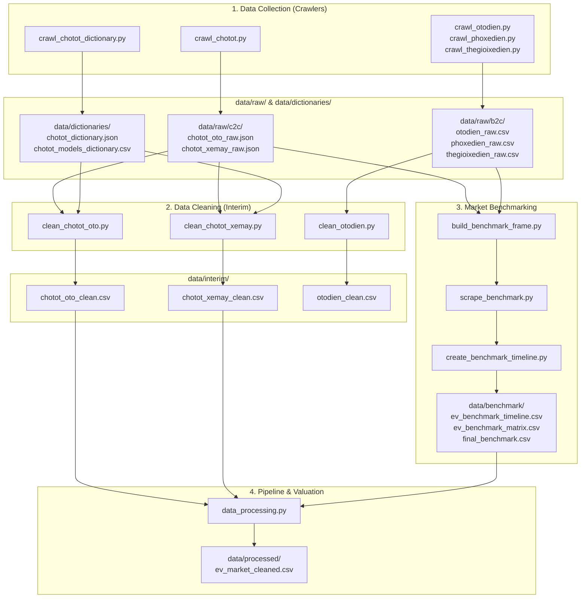

# 🚗 Electric Vehicle Market Monitor (Vietnam)

Hệ thống theo dõi, thu thập dữ liệu đa nguồn (C2C, B2C, Chính hãng) và chuẩn hoá phân tích thị trường xe điện (Ô tô điện & Xe máy điện) tại Việt Nam.

---

## 📁 Cấu trúc thư mục dự án

Dự án được tổ chức theo chuẩn **Modular Data Science Project**:

```text
Electric-Vehicle-Market-Monitor/
├── data/
│   ├── raw/                         # 1. DỮ LIỆU GỐC THU THẬP (RAW UNTOUCHED)
│   │   ├── c2c/                     # Nguồn tin rao cá nhân (Chợ Tốt)
│   │   │   ├── chotot_oto_raw.json
│   │   │   └── chotot_xemay_raw.json
│   │   └── b2c/                     # Nguồn showroom, đại lý kinh doanh
│   │       ├── otodien_raw.csv
│   │       ├── phoxedien_raw.csv
│   │       └── thegioixedien_raw.csv
│   │
│   ├── dictionaries/                # 2. TỪ ĐIỂN & METADATA PHÂN LOẠI
│   │   ├── chotot_dictionary.json   # Metadata Brand, Model, Option, Địa phương
│   │   └── chotot_models_dictionary.csv # Bảng tra cứu Brand - Model trực quan
│   │
│   ├── benchmark/                   # 3. GIÁ THAM CHIẾU & MA TRẬN THỊ TRƯỜNG
│   │   ├── benchmark_frame.csv      # Khung danh mục model trích xuất
│   │   ├── bonbanh_benchmark.csv    # Dữ liệu giá cào từ Bonbanh & đại lý
│   │   ├── final_benchmark.csv      # Bảng giá tham chiếu hoàn thiện theo frame
│   │   ├── ev_benchmark_timeline.csv # Ma trận timeline theo năm (Long format)
│   │   └── ev_benchmark_matrix.csv  # Ma trận timeline theo năm (Wide pivot table)
│   │
│   ├── interim/                     # 4. DỮ LIỆU LÀM SẠCH CẤP NGUỒN (INTERIM)
│   │   ├── chotot_oto_clean.csv     # Dữ liệu ô tô sạch tinh gọn
│   │   └── chotot_xemay_clean.csv   # Dữ liệu xe máy sạch tinh gọn
│   │
│   └── processed/                   # 5. DỮ LIỆU HỢP NHẤT PHỤC VỤ PHÂN TÍCH
│       └── ev_market_cleaned.csv    # Dữ liệu sạch hoàn chỉnh kèm benchmark & khấu hao
│
├── scripts/                         # Toàn bộ mã nguồn thu thập & xử lý dữ liệu
│   ├── crawlers/                    # Thu thập dữ liệu từ các sàn & website đại lý
│   │   ├── crawl_chotot.py          # Cào tin rao C2C Chợ Tốt (Ô tô & Xe máy điện)
│   │   ├── crawl_chotot_dictionary.py # Cào từ điển Brand, Model, Địa phương Chợ Tốt
│   │   ├── crawl_otodien.py         # Cào showroom Ô tô điện (otodien.vn)
│   │   ├── crawl_phoxedien.py       # Cào đại lý Phố Xe Điện (phoxedien.com)
│   │   └── crawl_thegioixedien.py   # Cào đại lý Thế Giới Xe Điện (thegioixedien.com.vn)
│   │
│   ├── cleaning/                    # Làm sạch & trích xuất feature chuyên sâu (Interim)
│   │   ├── clean_chotot_oto.py      # Làm sạch ô tô Chợ Tốt -> data/interim/chotot_oto_clean.csv
│   │   ├── clean_chotot_xemay.py    # Làm sạch xe máy Chợ Tốt -> data/interim/chotot_xemay_clean.csv
│   │   ├── clean_otodien.py         # Chuẩn hoá & phân loại pin salon otodien
│   │   └── list_features.py         # Thống kê coverage trường dữ liệu JSON
│   │
│   ├── benchmark/                   # Tạo khung giá tham chiếu (Benchmark Baseline)
│   │   ├── build_benchmark_frame.py # Bóc tách danh mục Model thực tế từ dữ liệu cào
│   │   ├── scrape_benchmark.py      # Cào giá benchmark từ Bonbanh & đại lý
│   │   └── create_benchmark_timeline.py # Tạo ma trận giá benchmark 2D theo năm sản xuất
│   │
│   └── pipeline/                    # Pipeline tích hợp tạo dữ liệu phân tích cuối
│       └── data_processing.py       # Ghép nối, tính khấu hao & sinh ev_market_cleaned.csv
│
├── notebooks/                       # Phân tích khám phá dữ liệu (EDA), Profiling
│   └── 01_profile_chotot.ipynb      # Notebook phân tích dữ liệu Chợ Tốt
│
├── .gitignore                       # Cấu hình bỏ qua môi trường ảo, cache, file tạm
├── requirements.txt                 # Các thư viện phụ thuộc của dự án
└── README.md                        # Tài liệu hướng dẫn sử dụng và kiến trúc dự án
```

---

## 🔄 Luồng xử lý dữ liệu (Data Pipeline Flow)



---

## 🚀 Hướng dẫn cài đặt & Thực thi

### 1. Cài đặt môi trường
```bash
python -m venv .venv
# Trên Windows (PowerShell):
.venv\Scripts\Activate.ps1
# Cài đặt thư viện:
pip install -r requirements.txt
```

### 2. Thu thập dữ liệu (Crawlers)
```bash
# Cào tin Chợ Tốt (Ô tô & Xe máy -> data/raw/c2c/):
python scripts/crawlers/crawl_chotot.py

# Cào từ điển phân loại Chợ Tốt (-> data/dictionaries/):
python scripts/crawlers/crawl_chotot_dictionary.py

# Cào các showroom đại lý B2C (-> data/raw/b2c/):
python scripts/crawlers/crawl_otodien.py
python scripts/crawlers/crawl_phoxedien.py
python scripts/crawlers/crawl_thegioixedien.py
```

### 3. Làm sạch dữ liệu (Interim Cleaning)
```bash
# Làm sạch dữ liệu Chợ Tốt Ô tô (-> data/interim/):
python scripts/cleaning/clean_chotot_oto.py

# Làm sạch dữ liệu Chợ Tốt Xe máy (-> data/interim/):
python scripts/cleaning/clean_chotot_xemay.py

# Làm sạch dữ liệu đại lý Ô tô điện:
python scripts/cleaning/clean_otodien.py

# Kiểm tra coverage thuộc tính JSON:
python scripts/cleaning/list_features.py
```

### 4. Tạo bộ chuẩn giá tham chiếu (Benchmark)
```bash
# Xây dựng danh sách model thực tế từ dữ liệu cào:
python scripts/benchmark/build_benchmark_frame.py

# Cào giá benchmark và hoàn thiện bảng giá:
python scripts/benchmark/scrape_benchmark.py

# Tạo ma trận timeline giá theo năm sản xuất (-> data/benchmark/):
python scripts/benchmark/create_benchmark_timeline.py
```

### 5. Xử lý dữ liệu hoàn chỉnh (Final Processed)
```bash
# Hợp nhất dữ liệu, tính khấu hao & trích xuất đặc trưng phục vụ phân tích / mô hình:
python scripts/pipeline/data_processing.py
```
