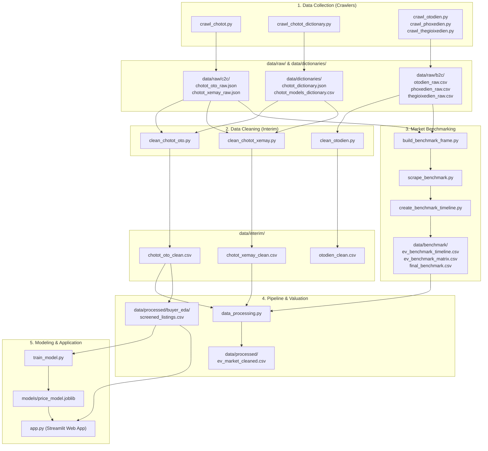

# ⚡ Electric Vehicle Market Monitor (Vietnam)

> Hệ thống theo dõi, thu thập dữ liệu đa nguồn (C2C, B2C, Chính hãng), chuẩn hoá và phân tích thị trường xe điện (Ô tô điện & Xe máy điện) tại Việt Nam — cung cấp thông tin thị trường minh bạch, mô hình định giá xe và ứng dụng phân tích tương tác hỗ trợ người mua xe.

---

## 📑 Mục lục / Table of Contents

- [Mục tiêu dự án (Project Goal)](#-mục-tiêu-dự-án-project-goal)
- [Cấu trúc thư mục (Directory Structure)](#-cấu-trúc-thư-mục-dự-án)
- [Nguồn dữ liệu (Data Sources)](#-nguồn-dữ-liệu-data-sources)
- [Luồng xử lý dữ liệu (Data Pipeline Architecture)](#-luồng-xử-lý-dữ-liệu-data-pipeline-architecture)
- [Giai đoạn phân tích & Mô hình (EDA & Modeling)](#-giai-đoạn-phân-tích--mô-hình-eda--modeling)
- [Ứng dụng Web tương tác (Streamlit Web App)](#-ứng-dụng-web-tương-tác-streamlit-web-app)
- [Hướng dẫn cài đặt & Thực thi (Getting Started)](#-hướng-dẫn-cài-đặt--thực-thi)
- [Nguyên tắc thiết kế & Giới hạn (Principles & Limitations)](#-nguyên-tắc-thiết-kế--giới-hạn)
- [Bản quyền (License)](#-bản-quyền-license)

---

## 🎯 Mục tiêu dự án (Project Goal)

Theo dõi và phân tích thị trường xe điện tại Việt Nam (tập trung trọng điểm vào hệ sinh thái xe điện VinFast):
1. **Thu thập (Collection):** Dữ liệu tin rao thời gian thực từ sàn C2C (Chợ Tốt) và các nền tảng showroom B2C (Ô Tô Điện, Phố Xe Điện, Thế Giới Xe Điện).
2. **Làm sạch & Bảo mật (Cleaning & PDPD Compliance):** Ẩn thông tin cá nhân (SĐT, địa chỉ), trích xuất tình trạng pin (kèm pin / thuê pin), khử trùng lặp và chuẩn hóa dữ liệu.
3. **Giá chuẩn tham chiếu (Benchmarking):** Xây dựng ma trận giá niêm yết chính hãng và giá thị trường theo năm sản xuất để tính toán tỷ lệ khấu hao.
4. **Phân tích chuyên sâu (EDA & Decision Support):** Phân tích tương quan giá - ODO, chênh lệch giá xe mới vs cũ, chi phí năng lượng và xu hướng thị trường.
5. **Ứng dụng & Mô hình (Machine Learning & Web App):** Huấn luyện mô hình Random Forest Regressor dự đoán giá xe và triển khai ứng dụng tương tác Streamlit.

---

## 📁 Cấu trúc thư mục dự án

Dự án được tổ chức theo chuẩn **Modular Data Science Project**:

```text
Electric-Vehicle-Market-Monitor/
├── app/                             # Module ứng dụng Web (Streamlit UI)
│   ├── charts.py                    # Khởi tạo biểu đồ trực quan tương tác
│   ├── data_loader.py               # Tải và tiền xử lý dữ liệu cho dashboard
│   └── model_loader.py              # Nạp mô hình ML dự đoán giá
├── app.py                           # Điểm chạy chính của Streamlit Web App
│
├── data/
│   ├── raw/                         # 1. DỮ LIỆU GỐC THU THẬP (RAW UNTOUCHED)
│   │   ├── c2c/                     # Tin rao C2C (Chợ Tốt ô tô & xe máy điện)
│   │   │   ├── chotot_oto_raw.json
│   │   │   └── chotot_xemay_raw.json
│   │   ├── b2c/                     # Showroom & đại lý B2C
│   │   │   ├── otodien_raw.csv
│   │   │   ├── phoxedien_raw.csv
│   │   │   └── thegioixedien_raw.csv
│   │   └── snapshots/               # Các snapshot thời gian thực của tin rao
│   │
│   ├── dictionaries/                # 2. TỪ ĐIỂN & METADATA PHÂN LOẠI
│   │   ├── chotot_dictionary.json   # Metadata Brand, Model, Option, Địa phương
│   │   └── chotot_models_dictionary.csv # Bảng tra cứu Brand - Model trực quan
│   │
│   ├── benchmark/                   # 3. GIÁ THAM CHIẾU & MA TRẬN THỊ TRƯỜNG
│   │   ├── benchmark_frame.csv      # Khung danh mục model trích xuất
│   │   ├── bonbanh_benchmark.csv    # Dữ liệu giá cào từ Bonbanh & đại lý
│   │   ├── final_benchmark.csv      # Bảng giá tham chiếu hoàn thiện theo frame
│   │   ├── ev_benchmark_timeline.csv # Ma trận timeline theo năm (Long format)
│   │   └── ev_benchmark_matrix.csv  # Ma trận timeline theo năm (Wide pivot table)
│   │
│   ├── interim/                     # 4. DỮ LIỆU LÀM SẠCH CẤP NGUỒN (INTERIM)
│   │   ├── chotot_oto_clean.csv     # Dữ liệu ô tô sạch tinh gọn
│   │   ├── chotot_xemay_clean.csv   # Dữ liệu xe máy sạch tinh gọn
│   │   ├── otodien_clean.csv        # Dữ liệu showroom ô tô điện làm sạch
│   │   ├── phoxedien_clean.csv      # Dữ liệu xe máy phố xe điện
│   │   └── thegioixedien_clean.csv  # Dữ liệu thế giới xe điện
│   │
│   ├── processed/                   # 5. DỮ LIỆU HỢP NHẤT PHỤC VỤ PHÂN TÍCH
│   │   ├── ev_market_cleaned.csv    # Dữ liệu thị trường xe điện hợp nhất & tính khấu hao
│   │   └── buyer_eda/               # Dữ liệu phục vụ phân tích quyết định mua sắm
│   │       ├── screened_listings.csv
│   │       ├── official_price_reference.csv
│   │       ├── buyer_comparison_candidates.csv
│   │       ├── matched_new_used_gap.csv
│   │       └── model_metrics.csv
│   │
│   └── external/                    # Dữ liệu tham chiếu bên thứ ba & snapshot hãng
│
├── data visualization/              # Jupyter Notebooks EDA phân tích thực nghiệm
│   ├── 01_eda_vinfast_oto.ipynb     # Phân tích nguồn cung, phân bố giá & thông điệp bán lẻ
│   └── 02_vinfast_buyer_eda.ipynb   # Hỗ trợ quyết định mua sắm & so sánh giá xe
│
├── figures/                         # Các biểu đồ tĩnh trích xuất chất lượng cao (PNG)
│
├── models/                          # Mô hình Machine Learning đã huấn luyện
│   └── price_model.joblib           # Pipeline Random Forest dự đoán giá xe
│
├── notebooks/                       # Notebooks thử nghiệm & pipeline
│   ├── 01_profile_chotot.ipynb      # Khảo sát dữ liệu Chợ Tốt
│   └── 04_vinfast_price_model.ipynb # Khảo sát & so khớp mô hình định giá
│
├── scripts/                         # Toàn bộ mã nguồn thu thập & xử lý dữ liệu
│   ├── crawlers/                    # Thu thập dữ liệu từ các sàn & website đại lý
│   │   ├── crawl_chotot.py
│   │   ├── crawl_chotot_dictionary.py
│   │   ├── crawl_otodien.py
│   │   ├── crawl_phoxedien.py
│   │   └── crawl_thegioixedien.py
│   ├── cleaning/                    # Làm sạch & trích xuất đặc trưng (Interim)
│   │   ├── clean_chotot_oto.py
│   │   ├── clean_chotot_xemay.py
│   │   ├── clean_otodien.py
│   │   └── list_features.py
│   ├── benchmark/                   # Tạo khung giá tham chiếu (Benchmark Baseline)
│   │   ├── build_benchmark_frame.py
│   │   ├── scrape_benchmark.py
│   │   └── create_benchmark_timeline.py
│   └── pipeline/                    # Pipeline tích hợp tạo dữ liệu phân tích cuối
│       └── data_processing.py
│
├── train_model.py                   # Script huấn luyện mô hình ML (Linear vs Random Forest)
├── discovery_report.py              # Script tự động trích xuất dataset discovery profiling
├── presentation_outline.md          # Đề cương bài báo cáo / thuyết trình
├── presentation_script.md           # Kịch bản thuyết trình (Tiếng Việt)
├── presentation_script_en.md        # Kịch bản thuyết trình (Tiếng Anh)
├── requirements.txt                 # Danh mục thư viện phụ thuộc toàn dự án
├── .gitignore                       # Quy tắc loại trừ tệp tạm, môi trường ảo
└── README.md                        # Tài liệu hướng dẫn sử dụng và kiến trúc dự án
```

---

## 🌐 Nguồn dữ liệu (Data Sources)

| Nguồn | Loại hình | Phương thức | Đối tượng xe | Đầu ra dữ liệu |
|-------|-----------|-------------|--------------|----------------|
| **Chợ Tốt** (chotot.com) | Sàn C2C | REST API (`gateway.chotot.com`) | Ô tô & Xe máy điện | `chotot_oto_raw.json`, `chotot_xemay_raw.json` |
| **Ô Tô Điện** (otodien.vn) | Đại lý B2C | HTML Scraping (BeautifulSoup) | Ô tô điện | `otodien_raw.csv` |
| **Phố Xe Điện** (phoxedien.com) | Đại lý B2C | HTML Scraping (BeautifulSoup) | Xe máy điện | `phoxedien_raw.csv` |
| **Thế Giới Xe Điện** (thegioixedien.com.vn) | Đại lý B2C | HTML Scraping (BeautifulSoup) | Xe máy điện | `thegioixedien_raw.csv` |
| **VinFast Official** | Giá niêm yết OEM | HTML / Parsing tham chiếu | VF 3, 5, 6, 7, 8, 9 | `data/external/`, `data/benchmark/` |

---

## 🔄 Luồng xử lý dữ liệu (Data Pipeline Architecture)


```mermaid
flowchart TD
    subgraph S1["1. Data Collection (Crawlers)"]
        C1["crawl_chotot.py"]
        C_DICT["crawl_chotot_dictionary.py"]
        C2["crawl_otodien.py<br/>crawl_phoxedien.py<br/>crawl_thegioixedien.py"]
    end

    subgraph RAW["data/raw/ & data/dictionaries/"]
        R_C2C["data/raw/c2c/<br/>chotot_oto_raw.json<br/>chotot_xemay_raw.json"]
        R_B2C["data/raw/b2c/<br/>otodien_raw.csv<br/>phoxedien_raw.csv<br/>thegioixedien_raw.csv"]
        R_DICT["data/dictionaries/<br/>chotot_dictionary.json<br/>chotot_models_dictionary.csv"]
    end

    subgraph S2["2. Data Cleaning (Interim)"]
        CL1["clean_chotot_oto.py"]
        CL2["clean_chotot_xemay.py"]
        CL3["clean_otodien.py"]
    end

    subgraph INTERIM["data/interim/"]
        I1["chotot_oto_clean.csv"]
        I2["chotot_xemay_clean.csv"]
        I3["otodien_clean.csv"]
    end

    subgraph S3["3. Market Benchmarking"]
        B1["build_benchmark_frame.py"]
        B2["scrape_benchmark.py"]
        B3["create_benchmark_timeline.py"]
        BM["data/benchmark/<br/>ev_benchmark_timeline.csv<br/>ev_benchmark_matrix.csv<br/>final_benchmark.csv"]
    end

    subgraph S4["4. Pipeline & Valuation"]
        P1["data_processing.py"]
        OUT["data/processed/<br/>ev_market_cleaned.csv"]
        BUYER["data/processed/buyer_eda/<br/>screened_listings.csv"]
    end

    subgraph S5["5. Modeling & Application"]
        TRAIN["train_model.py"]
        MODEL["models/price_model.joblib"]
        APP["app.py (Streamlit Web App)"]
    end

    C1 --> R_C2C
    C_DICT --> R_DICT
    C2 --> R_B2C
    R_C2C & R_DICT --> CL1 & CL2
    R_B2C --> CL3
    CL1 --> I1
    CL2 --> I2
    CL3 --> I3
    R_C2C & R_B2C --> B1 --> B2 --> B3 --> BM
    I1 & I2 & BM --> P1 --> OUT
    I1 --> BUYER --> TRAIN --> MODEL
    MODEL & BUYER --> APP
```

---

## 📊 Giai đoạn phân tích & Mô hình (EDA & Modeling)

### 1. Phân tích khám phá (EDA)
- **Notebook 01 — Phân tích Cung - Cầu & Định giá:** Khảo sát độ phủ dữ liệu, phân bố giá theo model (VF 3 -> VF 9), tương quan ODO với giá rao bán, phân tích các từ khóa ưu đãi (pin, góp, voucher).
- **Notebook 02 — Hỗ trợ quyết định Người mua (Buyer Decision Support):** So sánh chênh lệch giữa xe mới và xe đã qua sử dụng, ma trận ngân sách, mô hình chi phí năng lượng sạc điện so với xăng truyền thống.

### 2. Mô hình dự đoán giá xe (Price Prediction Model)
- Sử dụng **Random Forest Regressor** kết hợp **One-Hot Encoding** cho các biến phân loại (`family`, `condition`, `province`, `battery_status`) và chuẩn hóa các biến số (`year`, `mileage_km`).
- Mô hình được lưu tại [models/price_model.joblib](file:///d:/Workspace/b3/Data%20Science/ev%20monitor/models/price_model.joblib) và được tích hợp trực tiếp vào giao diện Streamlit.

---

## 💻 Ứng dụng Web tương tác (Streamlit Web App)

Ứng dụng web được xây dựng bằng Streamlit cho phép người dùng:
1. **Tổng quan thị trường:** Bộ lọc đa chiều theo Dòng xe, Tỉnh thành, Tình trạng xe và xem phân bố giá trực quan.
2. **So sánh New vs Used:** Xem mức độ chênh lệch giá trị và tỷ lệ khấu hao thực tế.
3. **Dự toán giá xe thông minh:** Nhập thông tin xe (dòng xe, năm sx, số km đã đi, tình trạng pin, vị trí) để nhận dự báo khoảng giá thị trường hợp lý.

---

## 🚀 Hướng dẫn cài đặt & Thực thi

### 1. Cài đặt môi trường
```bash
python -m venv .venv

# Kích hoạt trên Windows PowerShell:
.venv\Scripts\Activate.ps1

# Cài đặt toàn bộ thư viện:
pip install -r requirements.txt
```

### 2. Thu thập dữ liệu (Crawlers)
```bash
# Cào tin Chợ Tốt (Ô tô & Xe máy -> data/raw/c2c/):
python scripts/crawlers/crawl_chotot.py

# Cào từ điển phân loại Chợ Tốt (-> data/dictionaries/):
python scripts/crawlers/crawl_chotot_dictionary.py

# Cào các showroom đại lý B2C (-> data/raw/b2c/):
python scripts/crawlers/crawl_otodien.py
python scripts/crawlers/crawl_phoxedien.py
python scripts/crawlers/crawl_thegioixedien.py
```

### 3. Làm sạch dữ liệu (Interim Cleaning)
```bash
python scripts/cleaning/clean_chotot_oto.py
python scripts/cleaning/clean_chotot_xemay.py
python scripts/cleaning/clean_otodien.py
python scripts/cleaning/list_features.py
```

### 4. Tạo bộ chuẩn giá tham chiếu (Benchmark)
```bash
python scripts/benchmark/build_benchmark_frame.py
python scripts/benchmark/scrape_benchmark.py
python scripts/benchmark/create_benchmark_timeline.py
```

### 5. Xử lý dữ liệu hoàn chỉnh (Pipeline Processing)
```bash
python scripts/pipeline/data_processing.py
```

### 6. Huấn luyện mô hình định giá & Chạy Web App
```bash
# Huấn luyện lại mô hình ML:
python train_model.py

# Khởi chạy ứng dụng Streamlit:
streamlit run app.py
```

---

## ⚖️ Nguyên tắc thiết kế & Giới hạn (Principles & Limitations)

### Nguyên tắc thiết kế (Principles)
- **Tính bất biến của dữ liệu gốc:** Không ghi đè hoặc chỉnh sửa trực tiếp dữ liệu thô trong `data/raw/`.
- **Tuân thủ quy chuẩn PDPD:** Toàn bộ thông tin cá nhân (số điện thoại, địa chỉ cụ thể) được ẩn danh tự động trước khi công bố phân tích.
- **Tách biệt dữ liệu:** Tách bạch rõ ràng giữa tin rao cá nhân C2C, giá niêm yết showroom B2C và giá hãng OEM.

### Giới hạn (Limitations)
- Dữ liệu phản ánh **giá chào bán (asking prices)** trên các sàn giao dịch trực tuyến, không phải giá chốt giao dịch thực tế.
- Tình trạng pin được nhận diện thông qua thuật toán bóc tách từ khóa văn bản trên tiêu đề và mô tả của người bán.

---

## 📄 Bản quyền (License)

Dự án phục vụ mục đích nghiên cứu và giáo dục. Dữ liệu được trích xuất từ các trang công khai và trang chính thức của nhà sản xuất. Không lưu trữ thông tin nhận dạng cá nhân.
