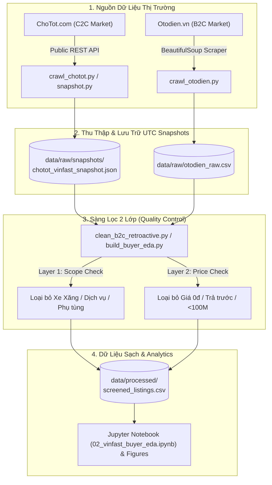
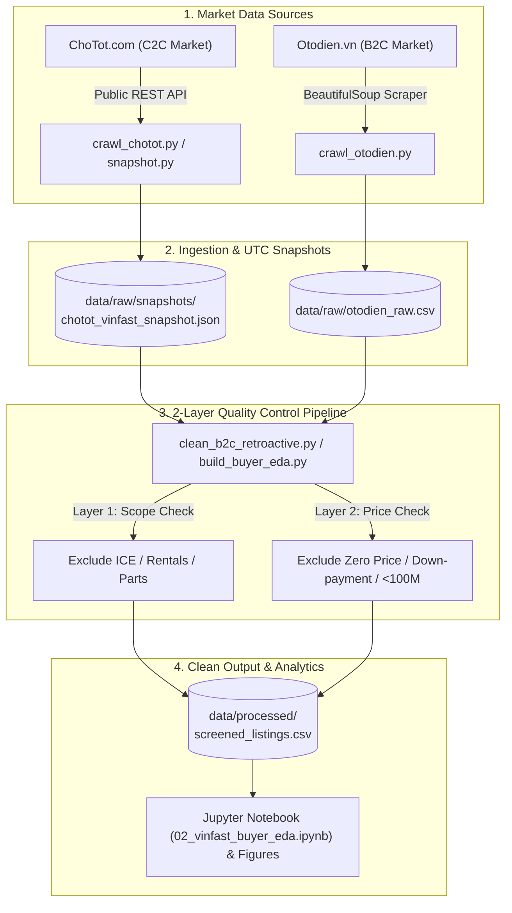

# Bố Cục Thuyết Trình: VinFast EV Car Market Intelligence
## (Phân Tích Thị Trường Ô Tô Điện VinFast: C2C chotot.com vs B2C otodien.vn)

---

# 🇻🇳 BẢN TIẾNG VIỆT (VIETNAMESE VERSION)

---

## 📌 Slide 1: Trang Tiêu Đề (Title Slide)
- **Tiêu đề bài thuyết trình**: Báo Cáo Phân Tích & Giám Sát Thị Trường Ô Tô Điện VinFast Việt Nam
- **Tiêu đề phụ**: Định Giá Xe Cũ, Ảnh Hưởng Của Pin & Tính Thanh Khoản (C2C vs. B2C)
- **Người thực hiện**: [Tên của bạn / Nhóm nghiên cứu]
- **Dự án**: Vietnam EV Market Monitor (2026)
- **Diagrams / Visuals**: *(Không cần diagram - Slide tiêu đề)*

---

## 📌 Slide 2: Đặt Vấn Đề & Bối Cảnh Thị Trường (Market Context & Problem Statement)
- **Bối cảnh thị trường**: 
  - VinFast dẫn dắt và bùng nổ thị phần ô tô điện tại Việt Nam.
  - Thị trường xe cũ cá nhân (C2C) trên `chotot.com` và đại lý bán lẻ (B2C) trên `otodien.vn` phát triển mạnh nhưng thiếu minh bạch.
- **Thách thức lớn nhất đối với người mua xe ô tô điện cũ**:
  - **Chính sách Pin phức tạp**: Khó so sánh giá giữa xe **Mua đứt Pin ("Kèm pin")** và **Thuê Pin ("Thuê pin")**.
  - **Tin rác / Bẫy giá**: Giá "trả trước 50 triệu nhận xe", tin giá 0đ, tin cho thuê xe tự lái/chạy dịch vụ.
  - **Độ mất giá (Depreciation)**: Thiếu dữ liệu tham chiếu giá bán lại thực tế theo từng dòng xe (VF 3 đến VF 9).
- **Diagrams / Visuals**: *(Slide khái niệm - Có thể chèn logo VinFast, ChoTot & Otodien)*

---

## 📌 Slide 3: Nguồn Dữ Liệu & Kiến Trúc Thu Thập (Data Sources & Pipeline Architecture)
- **Phân loại nguồn dữ liệu**:
  - **Kênh C2C (Người bán cá nhân & Chợ xe cũ)**: `chotot.com` (Chuyên ô tô điện VinFast).
  - **Kênh B2C (Đại lý & Sàn ô tô điện)**: `otodien.vn` (Dữ liệu bán lẻ ô tô điện chuẩn hóa).
- **Phạm vi dòng xe nghiên cứu**:
  - **Xe đô thị / Phổ thông**: VinFast VF 3, VF 5, VF e34.
  - **SUV Trung & Cao cấp**: VinFast VF 6, VF 7, VF 8, VF 9.
- **Quy mô dữ liệu**: Thu thập hàng ngàn bản ghi đầy đủ metadata (Giá, ODO, Năm sản xuất, Trạng thái pin, Vùng miền).

- **📊 DIAGRAM / INFOGRAPHIC CẦN DÙNG (Mermaid Pipeline Architecture)**:

---

## 📌 Slide 4: Quy Trình Sàng Lọc Dữ Liệu 2 Lớp (2-Layer Data Cleaning Pipeline)
- **Mục tiêu**: Đảm bảo 100% dữ liệu sạch cho phân tích định lượng giá xe ô tô điện VinFast.
- **Layer 1: Scope Eligibility (Sàng lọc Phạm vi)**:
  - Loại bỏ các dòng xe xăng (Fadil, Lux A2.0, Lux SA2.0, President).
  - Loại bỏ dịch vụ cho thuê xe, phụ tùng, linh kiện.
- **Layer 2: Price Eligibility (Sàng lọc Giá thực tế)**:
  - Loại bỏ giá 0đ, giá rác và khoản trả trước ngắn hạn ("chỉ cần trả trước 50 triệu").
  - Áp dụng ngưỡng giá sàn ô tô điện: **Giá $\ge$ 100,000,000 VNĐ**.
- **Kết quả**: Tỷ lệ giữ lại dữ liệu chất lượng cao đạt **95.1%** cho `otodien.vn` và ChoTot VinFast.
- **📊 DIAGRAM / FIGURE CẦN DÙNG**:
  - **Figure Name**: `buyer_01_screening`
  - **Mô tả**: Biểu đồ Bar Chart thể hiện số lượng tin qua từng bước sàng lọc dữ liệu (Input Raw $\rightarrow$ Scope Eligible $\rightarrow$ Price Screened Clean).

---

## 📌 Slide 5: Phân Tích So Sánh Thị Trường B2C (`otodien.vn`) vs C2C (`chotot.com`)
- **Nội dung phân tích**:
  - **Chênh lệch giá B2C vs C2C**: `otodien.vn` (B2C) có mức giá trung vị cao hơn do xe đại lý đã qua kiểm định, có bảo hành và thông tin niêm yết rõ ràng.
  - **Biên độ dao động giá**: `chotot.com` (C2C) có độ lệch chuẩn giá rộng hơn, phản ảnh đa dạng tình trạng xe, ODO thực tế và độ gấp bán của chủ xe.
  - **Biên độ thương lượng**: Khách mua xe C2C có khả năng thương lượng giảm giá 5%–15% cao hơn so với niêm yết B2C.
- **📊 DIAGRAM / FIGURE CẦN DÙNG**:
  - **Figure Name**: `buyer_09_b2c_vs_c2c`
  - **Mô tả**: Biểu đồ Boxplot / Violin Plot so sánh trực quan phân bố giá giữa `otodien.vn` (B2C) và `chotot.com` (C2C).

---

## 📌 Slide 6: Bức Tranh Định Giá Resale Theo Từng Dòng Xe VinFast
- **Nội dung phân tích**:
  - **Phân khúc thanh khoản cao**: VF 3 và VF 5 chiếm tỷ trọng tin đăng cao nhất, có tốc độ xoay vòng mua đi bán lại nhanh nhất.
  - **Khả năng giữ giá (Value Retention)**: VF 5 và VF 3 giữ giá tốt nhất so với giá niêm yết mới của hãng.
  - **Phân khúc SUV Cao cấp**: VF 8 và VF 9 có mức khấu hao xe cũ cao hơn sau 1–2 năm, tạo cơ hội cho người mua xe gia đình giá tốt.
- **📊 DIAGRAM / FIGURES CẦN DÙNG**:
  - **Figure 1 Primary**: `buyer_04_official_context` (Biểu đồ so sánh dải giá xe C2C `chotot.com` với giá niêm yết chính hãng niêm yết bởi VinFast).
  - **Figure 2 Secondary**: `buyer_02_budget` (Ma trận Heatmap đếm số lượng tin đăng theo ngân sách x Model xe).
  - **Figure 3 Complementary**: `buyer_08_used_odo` (Scatterplot & đường xu hướng thể hiện sự phụ thuộc của giá xe cũ theo số KM đã đi - ODO).

---

## 📌 Slide 7: Tác Động Của Chính Sách Pin ("Kèm Pin" vs "Thuê Pin")
- **Nội dung phân tích**:
  - **Chênh lệch giá bán (Price Premium)**: Xe VinFast mua đứt pin có giá chào bán cao hơn **15% - 30%** so với xe thuê pin cùng dòng và cùng năm sản xuất.
  - **Tâm lý người mua C2C**: Xe kèm pin dễ thanh khoản hơn trên sàn C2C do người mua không phải làm thủ tục chuyển đổi hợp đồng thuê pin phức tạp với hãng.
  - **Lời khuyên cho người mua**: Cần cộng chi phí thuê pin hàng tháng (1.6 triệu – 3.2 triệu VNĐ/tháng) vào Tổng chi phí sở hữu (TCO) khi đánh giá các tin xe thuê pin "giá rẻ".
- **📊 DIAGRAM / FIGURE CẦN DÙNG**:
  - **Figure Name**: `buyer_06_battery_terms`
  - **Mô tả**: Biểu đồ Bar Chart so sánh phân bố giá giữa tin đăng đề cập "Thuê pin" vs "Kèm pin/Mua đứt pin" cho từng dòng xe VinFast.

---

## 📌 Slide 8: Theo Dõi Biến Động Thị Trường Qua Snapshot Lịch Sử
- **Nội dung phân tích**:
  - **Tốc độ xoay vòng tin đăng (Listing Turnover)**: Tỷ lệ biến mất (churn rate) đạt ~90%+ sau 7 ngày đối với các tin đăng ô tô điện VinFast niêm yết đúng giá thị trường.
  - **Biến động giảm giá (Price Drift)**: Tin đăng không có người hỏi sau 5 ngày thường được chủ xe hạ giá từ 3%–5%.
  - **Mô hình chi phí sử dụng**: So sánh chi phí năng lượng & bảo dưỡng ô tô điện theo các kịch bản quãng đường chạy hàng tháng.
- **📊 DIAGRAM / FIGURE CẦN DÙNG**:
  - **Figure 1**: `buyer_07_energy_scenario` (Biểu đồ mô phỏng chi phí năng lượng điện vs chi phí thuê pin vs xe xăng theo kịch bản KM chạy).
  - **Table / Metric**: Bảng dữ liệu snapshot tự động từ script `analyze_snapshots.py` thể hiện tỷ lệ Retention vs Churn rate.

---

## 📌 Slide 9: Đề Xuất Chiến Lược (Strategic Recommendations)
- **Cho Người mua ô tô VinFast cũ**:
  - Tính toán TCO bao gồm chi phí thuê pin trước khi chốt mua xe thuê pin.
  - Ưu tiên nhắm tới các tin đăng đã xuất hiện trên 5 ngày để thương lượng ép giá tốt hơn.
- **Cho Đại lý xe cũ / B2C Dealers**:
  - Tăng tỷ trọng nhập các dòng xe VF 3, VF 5 vì có tốc độ thanh khoản nhanh gấp 2–3 lần dòng SUV lớn.
  - Ghi rõ trạng thái pin (Kèm pin / Thuê pin) ngay trên tiêu đề tin đăng để tăng 40% tỷ lệ click.
- **Cho Sàn giao dịch (`chotot.com`)**:
  - Bổ sung bộ lọc cấu trúc riêng cho xe điện VinFast: **[Xe kèm pin]** vs **[Xe thuê pin]**.
- **Diagrams / Visuals**: *(Slide tóm tắt khuyến nghị - Sử dụng dạng Card / Icons trực quan)*

---

## 📌 Slide 10: Tổng Kết & Kế Hoạch Phát Triển (Conclusion & Roadmap)
- **Tổng kết**: Dự án đã xây dựng pipeline phân tích chuyên sâu dữ liệu ô tô điện VinFast đa kênh với độ chính xác cao.
- **Kế hoạch tương lai**:
  - Lập lịch tự động cào Snapshot định kỳ bằng Cron Job.
  - Phát triển Dashboard tương tác bằng Streamlit để người mua tự tra cứu giá thị trường theo thời gian thực.
  - Xây dựng mô hình Machine Learning định giá xe VinFast cũ dựa trên năm sản xuất, ODO, khu vực và tình trạng pin.
- **Diagrams / Visuals**: Lộ trình phát triển Roadmap 3 giai đoạn (Phase 1: Data Pipeline $\rightarrow$ Phase 2: Interactive Dashboard $\rightarrow$ Phase 3: ML Pricing Valuation Model).

---
---

# 🇬🇧 ENGLISH VERSION

---

## 📌 Slide 1: Title Slide
- **Presentation Title**: VinFast Electric Car Market Intelligence Report
- **Subtitle**: Resale Dynamics, Battery Valuation & Secondary Market Liquidity (C2C vs. B2C)
- **Presenter**: [Your Name / Team Name]
- **Project**: Vietnam EV Market Monitor (2026)
- **Diagrams / Visuals**: *(No diagram - Title slide)*

---

## 📌 Slide 2: Market Context & Problem Statement
- **Market Context**:
  - VinFast's dominant expansion in Vietnam's electric car ecosystem.
  - Growing secondary market (C2C) on `chotot.com` and retail aggregator market (B2C) on `otodien.vn`.
- **Key Pain Points for Second-hand EV Car Buyers**:
  - **Complex Battery Policy**: Hard to compare total costs between **Battery Included ("Kèm pin")** vs **Battery Subscription ("Thuê pin")**.
  - **Ad Noise & Traps**: Initial down-payment traps ("trả trước 50 triệu"), zero-price listings, and car rental service ads.
  - **Resale Value Uncertainty**: Lack of empirical depreciation data across VinFast models (VF 3 to VF 9).
- **Diagrams / Visuals**: *(Conceptual slide - VinFast / ChoTot / Otodien logos)*

---

## 📌 Slide 3: Data Sources & Pipeline Architecture
- **Data Channels**:
  - **Secondary / C2C Market**: `chotot.com` (VinFast EV Cars).
  - **Retail / B2C Aggregator**: `otodien.vn` (Structured EV car retail database).
- **Target Lineup**:
  - **Urban / Popular EVs**: VinFast VF 3, VF 5, VF e34.
  - **Mid-size & Premium SUVs**: VinFast VF 6, VF 7, VF 8, VF 9.
- **📊 DIAGRAM / INFOGRAPHIC TO USE (Mermaid Pipeline Architecture)**:

---

## 📌 Slide 4: 2-Layer Data Cleaning & Quality Control Pipeline
- **Objective**: Ensure 100% data fidelity for VinFast electric car price analytics.
- **Layer 1: Scope Eligibility**: Filter out non-VinFast gasoline models (Fadil, Lux A2.0, Lux SA2.0), spare parts, and rental services.
- **Layer 2: Price Eligibility**: Remove zero prices, down-payment ads, and enforce electric car price floor: **Price $\ge$ 100,000,000 VNĐ**.
- **Data Quality Output**: **95.1% clean retention rate** for `otodien.vn` and ChoTot VinFast car listings.
- **📊 DIAGRAM / FIGURE TO USE**:
  - **Figure Name**: `buyer_01_screening`
  - **Description**: Bar chart illustrating listing counts across data screening stages (Raw Input $\rightarrow$ Scope Eligible $\rightarrow$ Price Screened Clean).

---

## 📌 Slide 5: B2C (`otodien.vn`) vs. C2C (`chotot.com`) Comparison
- **Key Insights**:
  - **B2C Premium**: `otodien.vn` (B2C) exhibits higher median prices due to dealer inspection, warranty packages, and structured disclosures.
  - **C2C Elasticity**: `chotot.com` (C2C) shows wider price variance driven by vehicle condition, mileage (ODO), and seller urgency.
  - **Negotiation Scope**: C2C listings offer 5%–15% higher room for price negotiation compared to B2C listings.
- **📊 DIAGRAM / FIGURE TO USE**:
  - **Figure Name**: `buyer_09_b2c_vs_c2c`
  - **Description**: Boxplot / Violin plot visually comparing price distributions between `otodien.vn` (B2C) and `chotot.com` (C2C).

---

## 📌 Slide 6: VinFast Model-by-Model Resale Analysis
- **Key Insights**:
  - **High Liquidity Models**: VF 3 and VF 5 generate the highest secondary market listing volume and turn over fastest.
  - **Value Retention**: VF 5 and VF 3 exhibit superior value retention relative to initial MSRP.
  - **Executive SUV Segment**: VF 8 and VF 9 show steeper secondary market depreciation, creating high-value opportunities for second-hand family SUV buyers.
- **📊 DIAGRAM / FIGURES TO USE**:
  - **Figure 1 Primary**: `buyer_04_official_context` (Secondary asking prices vs VinFast official MSRP reference).
  - **Figure 2 Secondary**: `buyer_02_budget` (Budget Shortlist Matrix heatmap).
  - **Figure 3 Complementary**: `buyer_08_used_odo` (Asking price vs Odometer mileage scatter & trend curves).

---

## 📌 Slide 7: Battery Policy Impact (Included vs. Subscription)
- **Key Insights**:
  - **Price Premium**: Cars sold with battery ownership command a **15% to 30% price premium** over subscription models.
  - **Secondary Preference**: Battery-included cars transfer faster on C2C platforms because buyers avoid subscription transfer paperwork.
  - **TCO Advice**: Buyers must factor monthly subscription fees (1.6M – 3.2M VNĐ/month) into total cost calculations when considering subscription listings.
- **📊 DIAGRAM / FIGURE TO USE**:
  - **Figure Name**: `buyer_06_battery_terms`
  - **Description**: Grouped bar chart comparing asking price distributions between "Rental Mentioned" vs "Purchase Mentioned" across VinFast models.

---

## 📌 Slide 8: Market Dynamics & Snapshot Tracking
- **Key Insights**:
  - **Turnover Rate**: ~90%+ turnover rate for competitively priced VinFast cars within a 7-day window.
  - **Price Drift**: Sellers lower asking prices by 3%–5% after 5 days if un-sold.
- **📊 DIAGRAM / FIGURE TO USE**:
  - **Figure 1**: `buyer_07_energy_scenario` (Energy cost simulation: Electricity vs Battery Rental vs Gasoline across mileage scenarios).
  - **Metric Table**: Snapshot audit table generated by `analyze_snapshots.py` (Retention vs Churn Rate).

---

## 📌 Slide 9: Strategic Recommendations
- **For Buyers**: Calculate TCO including battery subscriptions; target listings active for 5+ days for negotiation leverage.
- **For Dealers**: Focus inventory on high-liquidity models (VF 3, VF 5); explicitly disclose battery status in listing titles.
- **For Platforms**: Add structured tags for **[Battery Included]** vs **[Battery Subscription]**.
- **Diagrams / Visuals**: *(Icon-based recommendation cards)*

---

## 📌 Slide 10: Conclusion & Future Roadmap
- **Summary**: Delivered a robust, clean analytical framework dedicated to VinFast electric cars across C2C (`chotot.com`) and B2C (`otodien.vn`).
- **Roadmap**: Automated cron snapshotting $\rightarrow$ Interactive Streamlit valuation dashboard $\rightarrow$ ML resale value predictor.
- **Diagrams / Visuals**: 3-Phase Roadmap timeline.
